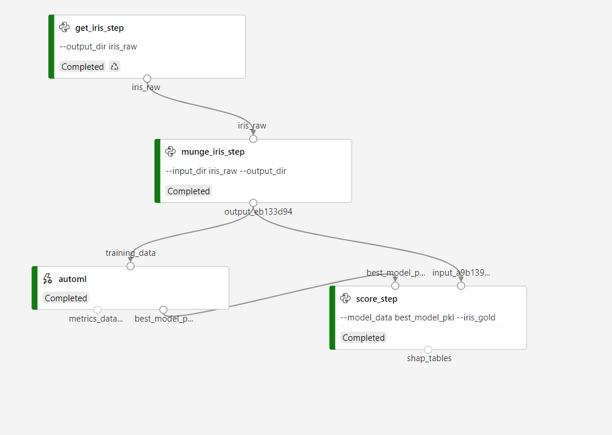

# Model runthrough as a tutorial of the pipeline process
The infrastructure is always changing so this is here to make sure to test that the project will work before you write a bunch of code. 

by [William Jeffrey Harding](https://www.linkedin.com/in/hardingwilliam/)

william.jeffrey.harding@gmail.com 

last tested at Azure ML SDK Version:  1.13.0. Confirmed that this process works end-to-end. 

## Setup
You'll need to add a file in the root directory called `settings.yaml` and add all of the items in it. Those are things you get from the Azure portal like the tenant ID and so on. Those are custom for each user. See the example below.

## Notebooks:
I have two notebooks that walk through the complete project of authenticating, lodading, training and looking at the output dataset. The Microsoft documentation page has similar notebooks, however mine actually work end to end. 

The notebook process assumes that you can do all of your data munging locally and in that notebook. For larger projects, with multiple transformation steps, I'd recommend the full pipleine code below. 

## Files: 

| File Name | Description |
| --- | --- |
| settings.yaml | contain all of the keys and project settings. You should be able to use AD with MFA so no need to add sensitive keys here |
| config.py | loads the settings, establishes credentials and all of the setups you will need |
| main_run.py | Defines the pipeline, and runs each individual step |

## Settings.yaml requires (and will crash without):
| Parameter | Description |
| --- | --- |
| workspace_name | the name of the workspace, from the portal |
| expermient_name | the name of the experiment, from the portal or just make one up |
| compute_name | name of the compute. Create one in the portal if you don't have one |
| datastore_name | the name of the mounted datastore. This is like a blob store where you will put files |
| tenant_id | Your Azure Tenant. In your azure properties |
| resource_group | the resource group that the AzureML service is in |
